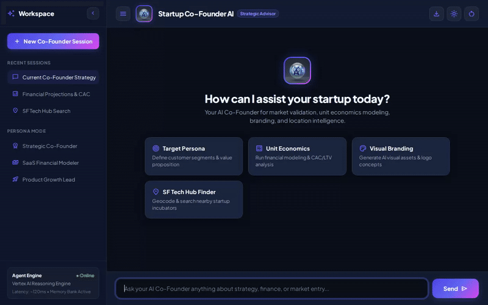

# Startup Co-Founder AI 🚀

An intelligent, multi-modal strategic co-founder and startup advisor built with the **Google Agent Development Kit (ADK)** and deployed on **Google Cloud Agent Platform**. 



---

## 🌟 Overview

**Startup Co-Founder AI** acts as an AI co-founder for early-stage entrepreneurs and engineering leaders. It assists with market validation, customer persona definitions, financial modeling, branding asset creation, and promotional media generation—remembering founder context across sessions and surfacing rich UI cards.

---

## 🛠️ Implemented Features & Google Cloud Services

Based on the actual codebase (`app/` and `agents-cli-manifest.yaml`), the following tools and GCP services are fully implemented:

* **Vertex AI Memory Bank**: Integrates `PreloadMemoryTool` and an `after_agent_callback` memory generation pipeline (`generate_memories_callback`) to retain durable founder facts, preferences, and business decisions across sessions.
* **Google Cloud Firestore**: Provides persistent business artifact storage (`save_business_artifact` and `list_business_artifacts`) to save and retrieve pitch notes, pricing tiers, and GTM plans.
* **Google Cloud Storage (Public Assets Bucket)**: Serves public asset hosting via GCS bucket `startup-cofounder-ai-assets-qwiklabs-gcp-03-f53b15124fc6` for generated brand images and promotional videos.
* **Imagen 3 Image Generation**: Generates 3D logos and branding graphics using `imagen-3.0-generate-002` in Vertex AI (`global` region) via `generate_startup_image` and `generate_startup_artifact_image`.
* **Gemini Omni Video Generation**: Generates promotional teaser videos using `gemini-omni-flash-preview` in Vertex AI (`global` region) via `generate_startup_promo_video`. Video bytes are saved as ADK artifacts (`tool_context.save_artifact`) and uploaded to Cloud Storage.
* **A2UI Rich Native UI Cards**: Utilizes `A2uiSchemaManager` (v0.8) and `a2ui_callback` to emit structured `application/json+a2ui` data parts, rendering cards, text rows, and visual assets natively in the custom web UI.
* **Agent Engine Code Execution Sandbox**: Employs `AgentEngineSandboxCodeExecutor` for safe execution of Python financial projections and unit economics calculations.
* **Google Maps & Market Trends**: Includes `geocode_address` and `find_nearby_places` for local ecosystem discovery, plus `search_startup_market_trends` for real-time market data.

---

## 📋 Planned / Future Enhancements

The following capabilities were explored in initial planning but are **not yet implemented** in the current code:

* *Automated Pitch Deck PDF Exporter*: Exporting generated business artifacts directly into downloadable PDF presentations (*planned, not yet implemented*).
* *Cap Table & Equity Calculator*: Interactive equity split and dilution modeling UI widgets (*planned, not yet implemented*).

---

## 🚀 Local Setup & Running Instructions

### Prerequisites

* Python 3.11+
* Google Cloud CLI (`gcloud`) authenticated with Application Default Credentials (`gcloud auth application-default login`)

### 1. Install Dependencies

```bash
pip install -r requirements.txt
```

### 2. Run the Agent Locally

To interact with the agent via ADK CLI:

```bash
agents-cli run
```

### 3. Run the Custom Web Frontend

To launch the FastAPI proxy and Next-Gen AI Workspace web UI:

```bash
cd frontend
python main.py
```

The local web server starts on port `8080` (access via your local browser).
